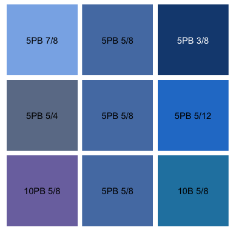

<!-- README.md is generated from README.Rmd. Please edit that file -->

<!--  -->

<!-- [](https://travis-ci.org/cwickham/munsell) -->

# munsell

The `munsell` package provides easy access to, and manipulation of, the
Munsell colours. The `munsell` package provides a mapping between
Munsell’s original notation (e.g. “5R 5/10”) and hexadecimal sRGB
strings suitable for use directly in R graphics. The package also
provides utilities to explore slices through the Munsell colour tree, to
transform Munsell colours and display colour palettes.

Munsell devised his system of colour notation to match the three
perceptual dimensions of colour: hue, value and chroma. His notation
provides a naming scheme to colours that eases the choice of color
according to a specific purpose. His century old advice is still
relevant for the producers of statistical graphics and the munsell
package aims to enable user to easily follow it.

Functions in `munsell` fall into three basic use categories: specifying
Munsell colours, altering Munsell colours and exploring the Munsell
color space.

The code below relies on the development version of `munsell`, get it
with:

``` r
devtools::install_github("cwickham/munsell")
```

## Color specification

Following Munsell, specifying colours is done with a specific string
format: “H V/C” where H is a hue code (see `mnsl_hues()` for a list of
those available, excluding “N”), V an integer in \([0, 10]\) specifying
value, and C an even integer specifying chroma. The `mnsl` function
takes the string and returns a hexadecimal RGB representation:

``` r
library(munsell)
mnsl("5R 5/10")
#> [1] "#C65858"
```

Visually examining a colour can either be done by using `mnsl` with a
base plotting call, or using `plot_mnsl` which plots colour swatches
using `ggplot2`:

``` r
plot.new()
rect(0, 0, 1 ,1 , col = mnsl("5R 5/10"))
plot_mnsl("5R 5/10")
```

## Colour manipulation

`munsell` provides convenience functions that alter a colour by taking
steps in the hue, value and chroma dimensions: `rygbp`, `pbgyr`,
`lighter`, `darker`, `saturate` and `desaturate`.

``` r
my_blue <- "5PB 5/8"
p <- plot_mnsl(c(
  lighter(my_blue, 2),      my_blue,   darker(my_blue, 2),
  desaturate(my_blue, 2),   my_blue,   saturate(my_blue, 2),
  rygbp(my_blue, 2),        my_blue,   pbgyr(my_blue, 2)))
p
```

<!-- -->

Each function optionally takes the number of steps to take in the
dimension and consequently are easily used to create scales in a
particular dimension.

``` r
p <- plot_mnsl(sapply(0:6, darker, col = "5PB 7/4"))
p + ggplot2::facet_wrap(~ num, nrow = 1)
```

<!-- -->

## Colour space exploration

Slices through the colour space of constant hue, chroma or value can be
displayed using the functions: `hue_slice`, `chroma_slice` and
`value_slice`. Additionally `complement_slice` displays a slice of
constant hue, alongside a slice of its complement, the hue that is on
the opposite side of the colour sphere to that specified.

``` r
complement_slice("5R")
```

<!-- -->
